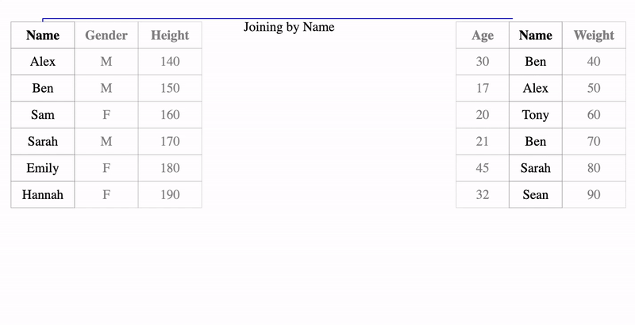
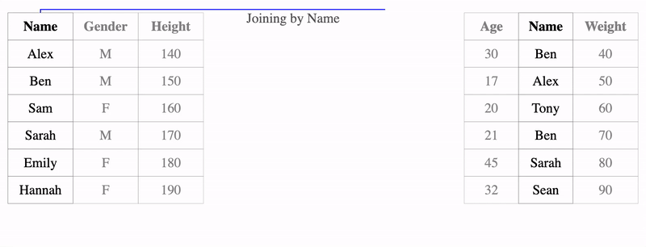
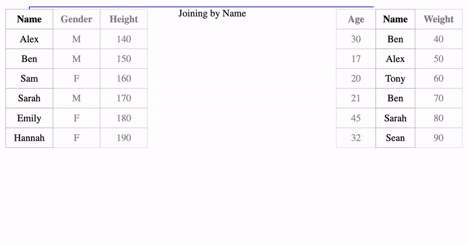
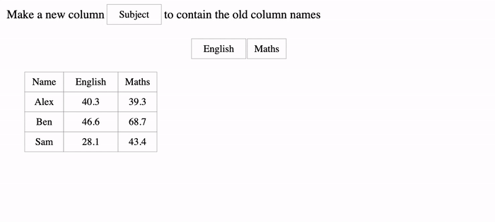

# dataAnim

A R package to generate animations for simple data wrangling operations.

  - [Installation](#installation)
  - [Examples](#examples)
      - [Left Join](#left-join)
      - [Inner Join](#inner-join)
      - [Full Join](#full-join)
      - [Wide to Long](#wide-to-long-gather)
      - [Long to Wide](#long-to-wide-spread)
  - [Backgound](#background)
      - [Abstract](#abstract)

## Installation

This packages can be installed by using the `devtools` package. It is
suggested to have the newest version of all the dependency packages and
have a relatively new version of **Rstudio**.

``` r
devtools::install_github("chrk623/dataAnim")
```

This package is still under development, if there are any **BUGS**
please report to [Issues](https://github.com/chrk623/dataAnim/issues).

*Note: The JavaScript code may not look very nice at the moment, they
will change overtime.*

## Examples

### Left Join

``` r
library(dataAnim)
data(datoy1)
join_anim(join_type = "left", speed = 1, x = datoy1$x, y = datoy1$y, by = "Name", show_msg = T)
```



### Inner Join

``` r
join_anim(join_type = "inner", speed = 1, x = datoy1$x, y = datoy1$y, by = "Name", show_msg = T)
```



### Full Join

``` r
join_anim(join_type = "full", speed = 1, x = datoy1$x, y = datoy1$y, by = "Name", show_msg = T)
```



### Wide to Long (Gather)

``` r
data(datoy_wide)
gather_anim(key = "Subject", value = "Score", col = c("English", "Maths"), data = datoy_wide)
```



### Long to Wide (Spread)

``` r
data(datoy_long)
spread_anim(key = "Subject", value = "Score", data = datoy_long)
```


## Background

This packages was a part of my Masters Thesis at the University of
Auckland. Supervised by Anna Fergusson and Chris Wild.

### Abstract

In the recent update of iNZight, a joining and reshaping module was
introduced. This module provides a tool for users to join and reshape
data sets. Though it is not difficult to apply these operations and
obtain the result with a tool like iNZight, there is a lack of tutorials
or tools that explain the underlying process of these operations in an
easy to understand manner. In this report, why these data operations are
useful and important will be discussed. Software will also be developed
that attempts to teach key concepts associated with joining and
reshaping data sets through animations.

The full report can be found at
[Link](https://github.com/chrk623/Thesis_2018-2019/blob/master/Masters_Thesis.pdf).
